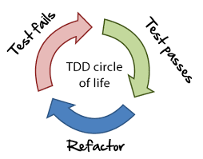
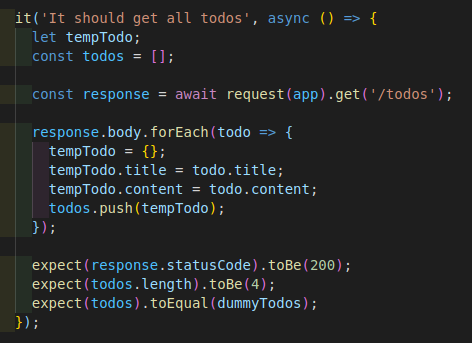
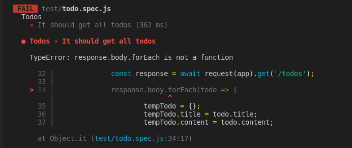
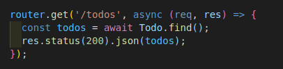
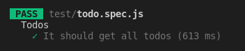
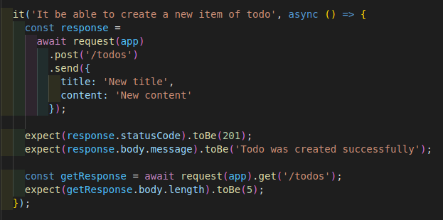
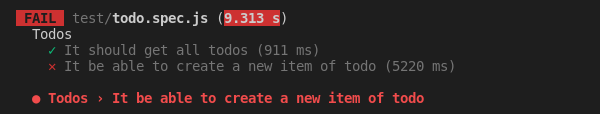
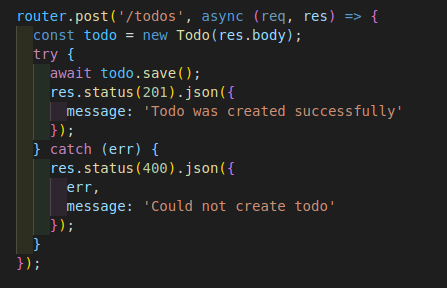
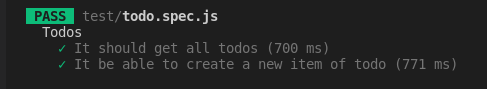

# tdd-study

  

<h2 style="color:gray; margin-bottom: 20px; margin-top: 20px">
	Basic level Test Driven Development study
</h2>

<h2 style="margin-bottom: 20px"> Get all todos </h2>

1) Firstly test case was created to fetch all todos

  

2) Unsuccessful results were seen when executed tests

  

3) In this step write method to fetch all todo

  

4) This time results is successful

  

5) After the successful result, code should refactor

<h2 style="margin-bottom: 20px; margin-top: 20px;">
	Create a new todo
</h2>

1) Test case was created for process of create new todo

  

2) Test cases were executed and result is failed

  

3) In this step write method to create new todo

  

4) Test cases executed again and result is passed

  

5) After the successful result, code should refactor